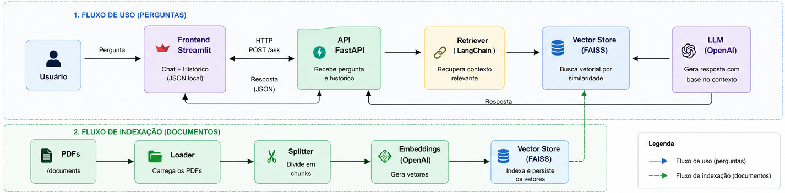

# 🧠 RAG Platform — Document Intelligence com LLMs

<p align="left">
  
  
  
  
  
  
  
  
</p>

## 📌 Visão Geral

Este projeto implementa uma plataforma de **Retrieval-Augmented Generation (RAG)** para consulta inteligente de documentos PDF, permitindo respostas baseadas exclusivamente em conhecimento interno.

Diferente de um chatbot genérico, o sistema atua como uma **camada de inteligência sobre documentos**, reduzindo alucinação e garantindo respostas contextualizadas.

A solução foi projetada com foco em:

* Arquitetura modular
* Separação clara entre backend e interface
* Facilidade de evolução para ambientes produtivos

---

## 🎯 Problema

LLMs por padrão:

* Não possuem acesso a dados privados
* Podem gerar respostas imprecisas (alucinação)
* Não mantêm contexto específico de negócio

A necessidade é permitir que usuários consultem documentos internos de forma natural, com respostas confiáveis.

---

## 💡 Solução

A solução utiliza o padrão RAG:

1. Indexação de documentos PDF
2. Geração de embeddings
3. Armazenamento vetorial
4. Recuperação de contexto relevante
5. Geração de resposta com LLM baseada apenas no contexto

Além disso, foi construída uma aplicação completa com:

* Backend via API
* Interface de chat
* Persistência de histórico local

---

## 🏗️ Arquitetura do Sistema



---

## ⚙️ Funcionalidades

### 🔹 RAG Engine

* Processamento de múltiplos PDFs
* Chunking inteligente
* Geração de embeddings
* Busca semântica
* Respostas contextualizadas

### 🔹 API

* Endpoint `/ask` para perguntas
* Endpoint `/health` para verificação
* Endpoint `/insert` para ingestão de documentos

### 🔹 Interface

* Chat interativo
* Histórico persistido localmente
* Múltiplas conversas
* Busca e organização de chats

---

## 🧰 Tecnologias Utilizadas

### 🔹 Backend

* Python
* FastAPI
* LangChain

### 🔹 Frontend

* Streamlit

### 🔹 IA / Machine Learning

* OpenAI API
* Embeddings
* RAG (Retrieval-Augmented Generation)

### 🔹 Armazenamento Vetorial

* FAISS

### 🔹 Infraestrutura

* Docker
* Docker Compose

---

## 🧩 Stack por Camada

| Camada    | Tecnologia | Responsabilidade     |
| --------- | ---------- | -------------------- |
| Interface | Streamlit  | Chat UI              |
| API       | FastAPI    | Orquestração         |
| RAG       | LangChain  | Pipeline IA          |
| Vetor     | FAISS      | Busca semântica      |
| LLM       | OpenAI     | Geração de respostas |
| Infra     | Docker     | Containerização      |

---

## 📂 Estrutura do Projeto

```
.
├── api/                # Camada de API
├── app/                # Lógica RAG
├── streamlit_app.py    # Frontend
├── documents/          # PDFs
├── storage/            # Índice vetorial
├── history/            # Conversas
├── docs/               # Imagens e diagramas
```

---

## ▶️ Execução

### 1. Variáveis de ambiente

```env
OPENAI_API_KEY=your_key
```

### 2. Subir aplicação completa (API + Frontend)

```bash
docker compose up --build
```

Serviços disponíveis em:

* API: [http://localhost:8000](http://localhost:8000)
* Frontend (Streamlit): [http://localhost:8501](http://localhost:8501)

---

## 🧪 Testando a API via cURL

### Health Check
```
curl -X GET http://127.0.0.1:8000/health
```

### Fazer pergunta
```
curl -X POST http://127.0.0.1:8000/ask \
  -H "Content-Type: application/json" \
  -d '{"question": "Cimegripe serve para o que?"}'
```

### Upload de PDF
```
curl -X POST http://127.0.0.1:8000/insert \
  -F "file=@/caminho/para/seu/arquivo.pdf"
```
---

## 🧠 Decisões de Arquitetura

### Uso de FAISS

Escolhido para simplicidade e performance local.

### Separação API vs UI

Permite:

* Escalar backend independentemente
* Trocar frontend no futuro

### Persistência local (JSON)

Suficiente para portfólio, evitando complexidade prematura.

---

## ⚠️ Trade-offs

* FAISS local não é distribuído
* Histórico não é multi-usuário
* Sem autenticação

Essas decisões foram intencionais para manter foco em aprendizado e entrega.

---

## 🔮 Evolução Natural

Este projeto foi estruturado para evoluir facilmente para:

* Armazenamento em S3
* Banco vetorial com pgvector
* Deploy em Kubernetes
* Autenticação e multi-tenant
* Observabilidade (logs/metrics)

---

## 📊 O que este projeto demonstra

* Construção de sistemas com LLM
* Arquitetura RAG end-to-end
* Exposição via API
* Integração backend + frontend
* Boas práticas de organização e evolução

---

## 🧩 Conclusão

Este projeto representa a transição de um experimento de IA para uma **plataforma estruturada**, demonstrando capacidade de projetar, implementar e evoluir sistemas baseados em LLMs.

Ele serve como base sólida para estudos em:

* MLOps
* AI Platform Engineering
* Sistemas de IA em produção
